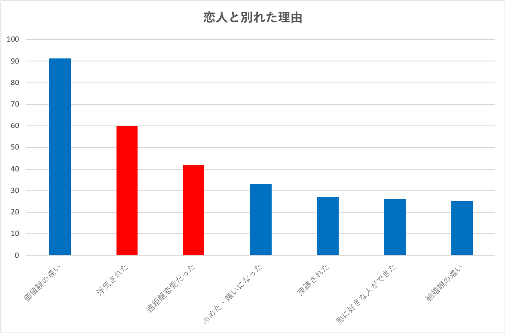

## 1 開発背景  

近年問題視されている少子化問題だが，内閣府「[令和2年版 少子化社会対策白書](https://www8.cao.go.jp/shoushi/shoushika/whitepaper/measures/w-2020/r02webhonpen/html/b1_s2-2-3.html)」より少子化の主な原因は「未婚化および晩婚化」であることが分かる． 

```
引用
少子化の主な原因は、未婚化・晩婚化と、有配偶出生率の低下であり、特に未婚化・晩婚化（若い世代での未婚率の上昇や、初婚年齢の上昇）の影響が大きいと言われている。
```  

そのため本プロジェクトでは，未婚化および晩婚化の原因に着目する．   

### 1.1 未婚化および晩婚化の原因
### 1.1.1 環境的要因による問題  

まず，未婚者において，結婚の前段階である交際状態にある割合を調査する．  
国立社会保障・人口問題研究所「[第16回出生動向基本調査（結婚と出産に関する全国調査）](https://www.ipss.go.jp/ps-doukou/j/doukou16/doukou16_gaiyo.asp)」の  
**「調査・年齢別にみた、未婚者の異性との交際の状況(恋人または婚約者がいる割合)」**  
より，交際状態にある割合は1992年から緩やかに下がっている．  
ただし，  
**「調査・年齢別にみた、性交経験のある未婚者割合」**  
より，性交経験の有りの割合は，1992年からの交際状態の降下率に比べて変化がない．  
  
Fig.1.1.1.1 未婚者における異性との交際状況まとめ  

一般に交際関係を経て性交経験に至るため，交際関係になったものの結婚まで進まず別れてしまう人が増加していると考えられる．  

別れる原因としては，ウェブスターマーケティング株式会社「[恋人と別れた理由](https://lovema.jp/koikatsu/couple-hakyoku-ranking)」より，人的理由と環境的理由に分類できる．  
  
Fig.1.1.1.2 恋人と別れた理由(赤色箇所：環境的理由 / 青色箇所：人的理由)  

人的理由の場合，相性の良い人を選ぶ必要があり，こちらは「[少子化社会対策大綱](https://www8.cao.go.jp/shoushi/shoushika/law/taikou_r02.html)」より，自治体や商工会議所による結婚支援で，適切な出会いの機会の創出・後押しを実施している．  
そのため，本プロジェクトでは環境的要因に着目する．環境的理由としては，遠距離恋愛などの物理的な距離や，浮気などの心理的な距離が離れていることが原因に考えられる．  

### 1.1.2 時代錯誤的要因による問題

また，未婚者において，結婚しない理由を調査する．同じく国立社会保障・人口問題研究所「[第16回出生動向基本調査（結婚と出産に関する全国調査）](https://www.ipss.go.jp/ps-doukou/j/doukou16/doukou16_gaiyo.asp)」では「独身でいる理由」を集計している．
  
Fig.1.1.2.1 独身でいる理由(注目箇所を濃く描写してあるため注意)

近年，割合が上昇傾向にある項目は「今は、趣味や娯楽を楽しみたいから(女性)」，「異性とうまくつき合えないから(男性/女性)」である．
「今は、趣味や娯楽を楽しみたいから(女性)」に関しては，[働き方改革を推進するための関係法律の整備に関する法律](https://www.mhlw.go.jp/stf/seisakunitsuite/bunya/0000148322_00001.html)などで，長時間労働の是正や多様で柔軟な働き方の実現を介して対策を行っている．  
「異性とうまくつき合えないから(男性/女性)」に関しては，[同調査]((https://www.ipss.go.jp/ps-doukou/j/doukou16/doukou16_gaiyo.asp))の「異性の交際相手と知り合ったきっかけ」より，インターネットを使ったサービスを介して交際相手と知り合っている割合が近年急増していることから，フィジカルな関わりが少なくなったためと考えられる．  

### 1.2 未婚化および晩婚化の解決策  
上記をまとめると，